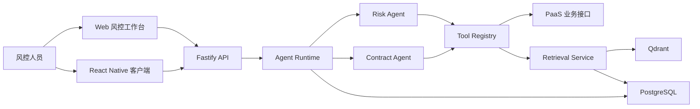

# 架构边界

## 1. 系统上下文



Runtime 是独立、常驻、可被多端调用的服务。Web 和 RN 是客户端，不拥有 Agent 状态；PostgreSQL 是运行与业务治理数据的事实来源；Qdrant 是可重建的知识检索索引。

## 2. 目标代码结构

```text
apps/
  api/                 HTTP、JWT、SSE、错误映射和依赖装配
  web/                 风控业务工作台
agents/
  risk-agent/          风控工作流、覆盖维度和输出规则
  contract-agent/      合同合规工作流，用于证明复用
packages/
  domain/              跨模块领域契约
  agent-runtime/       Run 生命周期、状态转换和恢复入口
  agent-protocol/      事件、sequence、回放和客户端投影契约
  tool-registry/       工具注册、授权、执行、审计和幂等
  persistence/         PostgreSQL Repository、事务和迁移
  auth/                JWT 验证与 IdentityContext
  retrieval/           文档索引、Qdrant 查询和 Evidence 定位
  model-provider/      真实模型与确定性测试模型
  rn-agent-sdk/        与状态框架无关的 RN 接入 SDK
mcp-servers/
  paas-tools/          将已治理工具暴露为 MCP，不绕过 Registry
```

## 3. 模块职责与禁止事项

| 模块 | 负责 | 禁止 |
| --- | --- | --- |
| `apps/api` | 认证入口、请求校验、API、SSE、依赖装配 | 编写风控规则、直接查询 Qdrant |
| `agent-runtime` | Agent 注册、Run 状态机、checkpoint 恢复、审批入口 | 出现供应商、合同等领域字段 |
| `risk-agent` | 风控规划、取证维度、Finding 规则和工作流 | 直接读数据库、信任客户端租户参数 |
| `tool-registry` | Schema、Scope、对象权限、超时、审计、幂等 | 决定风控结论、保存 UI 状态 |
| `persistence` | 事务、Repository、租户条件和数据库约束 | 调模型、拼接 Prompt |
| `retrieval` | 文档索引、权限过滤、召回、定位 | 作为业务事实来源、接受模型提供的 tenantId |
| `model-provider` | 结构化规划和 Finding 生成 | 执行工具、审批写操作、决定租户权限 |
| `agent-protocol` | 稳定事件契约、sequence 和回放语义 | 依赖 Web/RN 组件 |
| `apps/web` | 人机协作、事件投影、Evidence 和审批 UI | 成为 Run 事实来源、持久化敏感 Token 到 Zustand |
| `rn-agent-sdk` | API、SSE、重连、补发、游标持久化和跨端生命周期抽象 | 绑定 React、React Native、Redux 或 Zustand |

依赖方向必须满足：

```text
apps -> agents -> packages
apps -> packages
mcp-servers -> tool-registry
packages 不依赖 agents
agents 不依赖 apps
```

## 4. 运行边界

### 4.1 Runtime 与 LangGraph

- LangGraph 负责单个 Agent 的节点调度、状态合并、条件边和 checkpoint。
- Runtime 负责 Agent 注册、Run 记录、租户访问、状态转换、审批入口和统一事件。
- `waiting_approval` 必须是可持久化暂停点，而不是进程内函数等待。
- Runtime 只接受经过认证生成的 `IdentityContext`，不从 Agent 输入读取身份。

### 4.2 固定控制面与动态决策面

固定控制面包括最大迭代次数、工具预算、权限、审批、Evidence 校验和状态转换。动态决策面只允许模型生成结构化取证计划、缺失维度和 Finding。

模型输出必须经过 Schema 和策略校验；模型选择的工具不在允许列表、参数越界或请求写工具时，计划被拒绝并记录事件。

## 5. 数据所有权

### PostgreSQL：事实来源

- Agent 定义与版本
- Run、节点 checkpoint 和状态转换
- 事件日志与消费序号
- 工具调用审计和幂等记录
- Evidence、Finding、审批和业务回写
- 知识文档元数据、版本和索引状态
- Outbox 事件

### Qdrant：派生索引

- 文档 Chunk 向量
- `tenant_id`、`document_id`、`version`、`locator`
- `permission_tags` 和业务对象关联

Qdrant 数据可由 PostgreSQL 文档和 Outbox 重建。写入流程不采用请求内双写：事务先提交文档元数据与 Outbox，再由索引任务更新 Qdrant 并回写索引状态。

## 6. 安全与多租户边界

```text
JWT 验证
  -> IdentityContext
  -> Runtime Run 租户校验
  -> Tool Registry Scope 与对象权限
  -> PostgreSQL tenant_id 条件或 RLS
  -> Qdrant tenant_id + permission_tags Filter
```

- `tenantId`、`userId`、`roles`、`scopes` 只来自可信身份上下文。
- Agent、Prompt、工具参数和请求体中的身份字段都不可信。
- 客户端永远不能获得 Qdrant 或业务数据库凭据。
- 管理员权限与业务数据权限分离，查看运行元数据不代表可查看 Evidence 原文。
- 写工具需要人工审批凭据、Scope、对象权限和幂等键同时成立。

## 7. 事件边界

每个 Run 的事件具有单调递增 `sequence`。服务端先持久化事件，再向在线订阅者发送；客户端按 `(runId, sequence)` 去重。

```text
历史回放 after=lastSequence
  + SSE 实时事件
  -> Event Projector
  -> 节点、工具、Evidence、审批的 UI 投影
```

事件是运行过程事实，不直接等同于完整领域对象。客户端收到 `approval.required` 后仍应查询 Run/Approval API 获取服务端最终状态。

## 8. 写入一致性边界

系统采用“至少一次尝试、最多一次业务副作用”的目标语义：

1. Runtime 为写操作生成稳定幂等键。
2. Tool Registry 在数据库事务中占用幂等键。
3. 业务适配器将幂等键传递给支持幂等的下游；不支持时使用本地业务唯一键。
4. 成功结果持久化后才推进 Run 状态。
5. 崩溃恢复时复用同一幂等键，返回已有结果。

不能宣称分布式 exactly-once；面试和文档统一使用上述实际语义。

## 9. 客户端状态边界

- PostgreSQL：最终事实。
- TanStack Query：Web 服务端状态缓存。
- Zustand：SSE 连接、`lastSequence`、事件去重和时间线投影。
- URL：当前 Run、Tab 和可分享筛选条件。
- React 本地状态：未提交表单、弹窗和临时交互。
- RNModules：通过框架无关 SDK 接入既有 Redux/HOC 体系。

## 10. 部署边界

首个可演示版本采用模块化单体：一个 Fastify API 进程、一个 Web 应用、PostgreSQL 和 Qdrant。索引任务可以先由同一代码库中的独立 worker 进程运行。

只有在性能测试证明事件推送、索引或工具执行需要独立扩缩容时，才拆分服务或引入 Redis/消息队列。

## 11. 当前实现差距

当前代码已经具备 PostgreSQL 版 Runtime、Tool Registry、Event Store、JWT、持久化 checkpoint、Evidence/Finding、审批竞争、状态转换审计、对象权限策略、启动恢复扫描、PaaS 元数据工具编译器、MCP 适配层、RN Agent SDK 核心和合同合规 Agent。尚未满足的目标边界如下：

- 对象权限已采用 `appName/metaName/action/objectId` 策略接口，当前规则实现用于开发和测试，真实 PaaS 权限客户端待接入。
- 自动恢复当前由 API 启动扫描触发，多副本协调租约和周期 worker 尚未实现。
- Run、事件和业务产物目前分别提交，尚未形成统一事务/Outbox 协调。
- 项目、供应商、企业风险、流水和写回工具仍为确定性 Mock；制度检索已接入可切换的内存/Qdrant 实现。
- 动态规划、Qdrant 适配、Web 工作台、验收规模真实质量评测、元数据工具、MCP、跨端 SDK、生命周期实验台和第二 Agent 已实现；真机系统行为、合同专属业务页面和真实 PaaS Gateway 尚未实现。

任何简历和演示材料必须区分“已实现”与“目标设计”。
