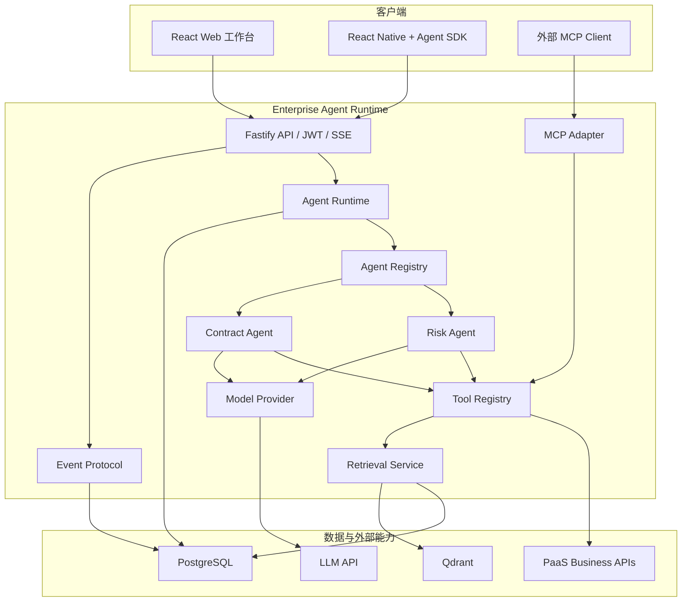
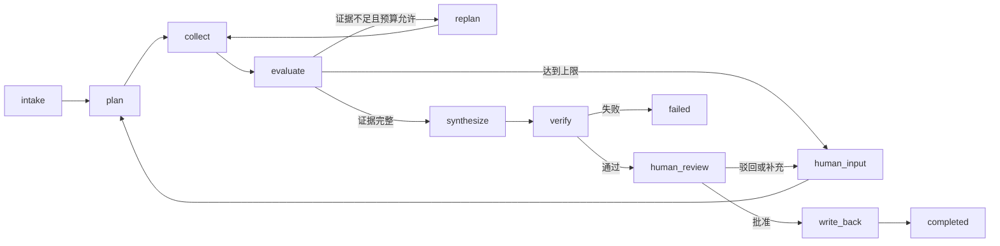
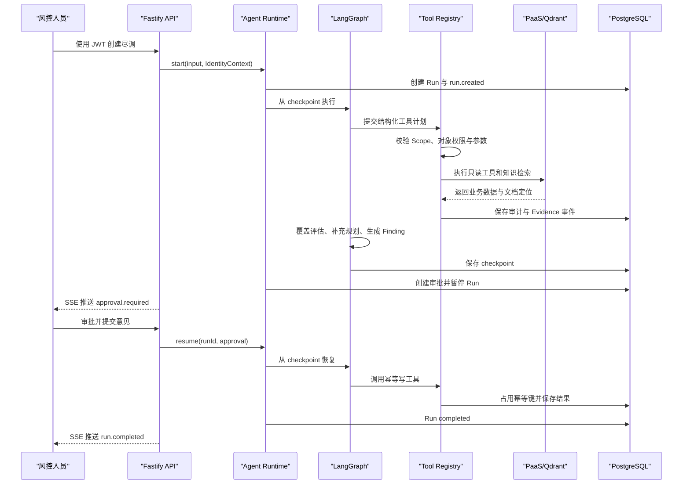

# 总体架构设计

## 1. 架构目标

系统需要同时支持以下能力：

1. 多个业务 Agent 复用统一执行、事件、工具、审批和审计内核。
2. Web、React Native 和外部系统通过稳定协议接入同一个 Run。
3. Agent 可以动态规划，但不能越过权限、预算、证据和人工审批边界。
4. 长任务可以暂停、重启恢复、补发事件并避免重复业务写入。
5. 风险结论可以追溯到业务对象或知识文档的确定位置。

详细模块职责见[架构边界](architecture-boundaries.md)，关键取舍见[ADR](adr/README.md)。

## 2. 目标架构



## 3. 业务执行模型

目标 Risk Agent 使用受约束动态状态图：



模型参与 `plan`、`replan` 和 `synthesize`；其他路由、验证和副作用由确定性代码控制。最大迭代、工具数、Token、时间和写权限是硬约束。

## 4. Run 状态模型

```text
queued -> running
running -> waiting_input | waiting_approval | failed | cancelled
waiting_input -> running | cancelled
waiting_approval -> running | cancelled
running -> completed
completed | failed | cancelled 为终态
```

状态转换由 Runtime 统一执行并记录操作者。Agent 节点不能直接修改数据库 Run 状态；它返回受验证的执行结果，由 Runtime 提交状态与事件。

数据库枚举已经覆盖上述状态；当前 Risk Agent 实际使用 `running`、`waiting_approval`、`completed` 和 `failed`。`waiting_input` 与 `cancelled` 的 API 操作将在动态 Loop 阶段接入。

## 5. 一次目标执行链路



## 6. 当前实现

当前实现是目标架构的可靠 Runtime 与动态规划切片：

```text
POST /api/runs
  -> AgentRuntime.start
  -> Risk Agent 通过 Model Provider 生成结构化只读取证计划
  -> 控制面校验白名单、缺失维度、重复工具和轮次预算
  -> Tool Registry 执行本轮受控只读工具
  -> evaluate 计算缺失维度，最多 replan 三轮
  -> 生成五条 Evidence 与两条 Finding
  -> waiting_approval
POST /api/runs/:id/approve
  -> PostgreSQL 原子占用 Approval
  -> Command(resume) 从 LangGraph checkpoint 恢复
  -> Tool Registry 使用稳定幂等键调用 Mock 写工具
  -> completed
```

配置 `DATABASE_URL` 后，Run、事件、审批、Evidence、Finding、工具审计、幂等记录和 LangGraph checkpoint 均持久化到 PostgreSQL。事件 sequence 在数据库事务中递增；服务重建后可回放事件并从审批暂停点继续。未配置数据库时保留同契约的内存实现，用于快速单元测试。

故障注入覆盖“写工具和 checkpoint 已完成，但 Run 状态保存失败”的窗口。恢复逻辑先读取最终 checkpoint：图已结束则只校准 Run；图仍暂停才恢复执行。稳定幂等键会传递给工具适配器，因此不会产生第二条整改任务。

Model Provider 提供确定性测试实现和 OpenAI Responses API Structured Outputs 实现。模型只负责计划与候选 Finding；工具参数、路由、预算、权限、引用校验和副作用仍由确定性代码控制。知识检索后端已实现文档版本、Outbox、Embedding 与 Qdrant 适配，当前尚未用真实案件建立模型/检索质量基线，也未做生产规模验证。

## 7. 可靠性语义

- 事件：先持久化后推送，客户端可重复接收并按 sequence 幂等投影。
- 节点：checkpoint 之前的节点可能因故障重试，工具调用必须考虑重复执行。
- 写回：使用稳定幂等键和数据库唯一约束，实现“至少一次尝试、最多一次业务副作用”。
- 检索索引：PostgreSQL 事务 Outbox 驱动 Qdrant，允许短暂最终一致并支持重建。
- 模型：结构化输出无效时有限重试，失败后进入人工处理，不将自由文本当执行计划。

## 8. 可观察性

统一事件至少覆盖：

```text
run.created / run.completed / run.failed
node.started / node.completed / node.failed
plan.created / plan.rejected
tool.started / tool.completed / tool.failed
evidence.added
approval.required / approval.completed
writeback.completed
```

每条记录关联 `runId`、`tenantId`、`sequence`、`timestamp`、Agent 版本和必要的 trace 信息。日志不得保存原始 JWT、完整敏感文档或未经脱敏的银行流水。

## 9. 演进顺序

1. M1 已完成 PostgreSQL、JWT、持久化 checkpoint、事件和幂等核心链路，继续收口状态审计和对象权限。
2. M2 完成动态 Loop、Model Provider、RAG 后端和 Web 工作台。
3. M3 最后实现 PaaS 元数据工具、MCP、RN SDK 和 Contract Agent。

具体交付物和退出门槛见[实施里程碑](milestones.md)与[验收标准](acceptance-criteria.md)。
