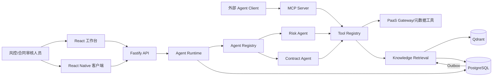
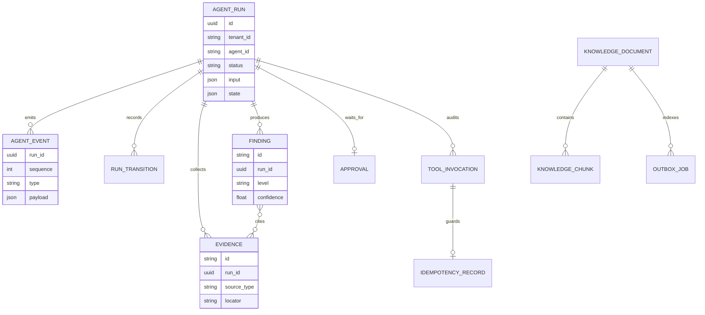
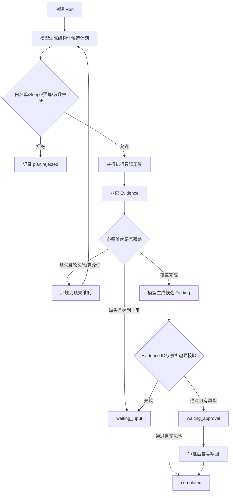
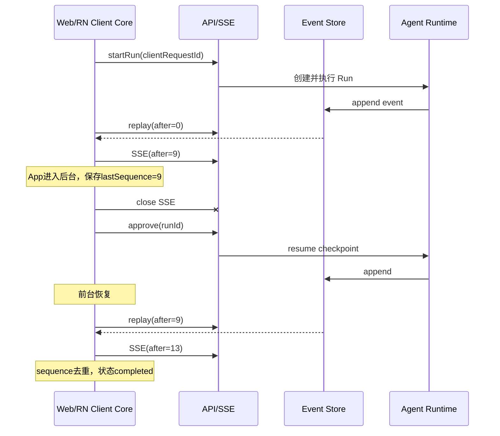
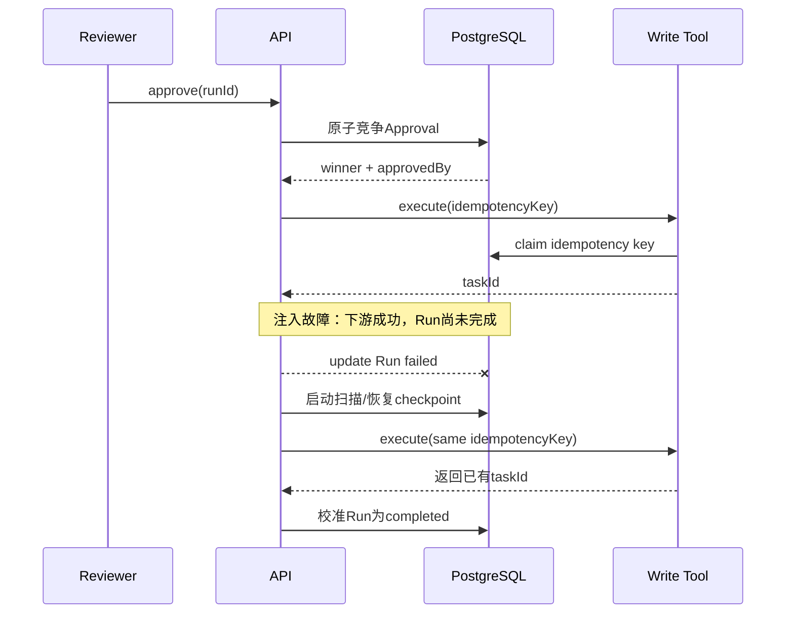
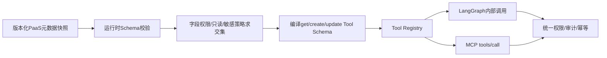

# 面试架构图集

## 1. 系统全景

边界：Runtime 不依赖 Web、RN 或 MCP Transport；Tool Registry 是所有工具执行的唯一入口；PostgreSQL 是事实源，Qdrant 是可重建派生索引。

## 2. 核心数据模型

## 3. 受约束动态 Loop

动态的是工具选择和补证计划；固定的是可执行工具、预算、退出条件、引用校验与写审批。

## 4. 客户端断线恢复

## 5. 审批与崩溃窗口

实际语义是审批事实唯一、稳定幂等键下副作用最多一次；不宣称跨任意下游的分布式 exactly-once。

## 6. PaaS 元数据到工具

